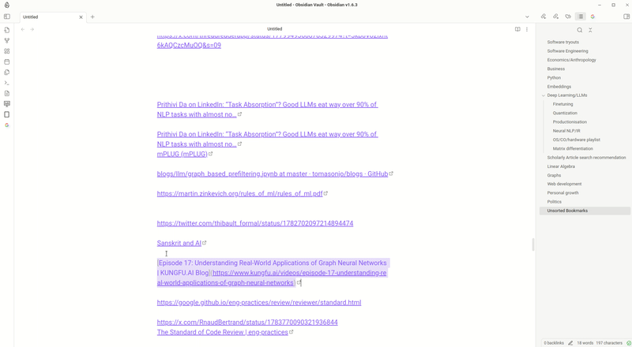

# Smart Text Mover

Smart text mover helps in organizing text/external links in files by making smart suggestions around the headings under
which the text can be moved. It supports three modalities:

1. No classification: List target sections based on their position in the file
2. LLM classification: List most likely target sections by using LLMs(gpt3.5 etc). Handy when you don"t have enough data
   in file.
3. Naive bayes classifier(recommended): List most likely target sections by using Naive Bayes classifier. Self improves
   as you use it
   more and more.

### Demo
#### Move text in file

#### Settings

### How it works

Select line you want to move else where in the file and invoke "smart-text-mover". It suggest headings under which it
can be moved sorted by their proximity to the selected text. This proximity is calculated using a lightweight classical
machine
learning algorithm called ([Naive Bayes Classifier](https://en.wikipedia.org/wiki/Naive_Bayes_classifier)). It does so
by examining existing words distribution under different headings and then ranking them based on that. This ranked list
of target location allows user to easily move/organize text in the file. Example usage includes sorting bookmarks based
on different categories. Performs best when used with [url-namer](https://github.com/zfei/obsidian-url-namer)

### Compilation

1. Clone this repo.
2. npm i or yarn to install dependencies
3. npm run build to compile, or npm run dev to start compilation in watch mode.

### Installation

After compiled, rename the dist directory to obsidian-url-namer and move it into the vault's plugin directory
VaultFolder/.obsidian/plugins/.

[//]: # (### Changelog)

### Checklist 
- [x] First release
- [ ] Add bulk classifier

[//]: # (### Support)

